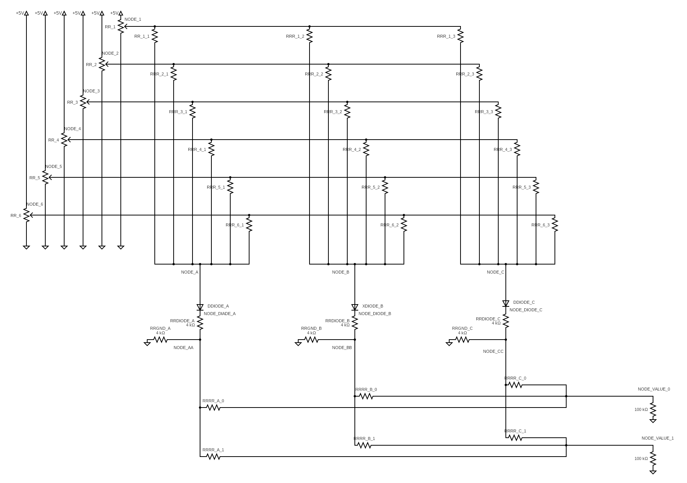

# Analogue Shallow Multilayer Perceptron

## Authors
- Caterina María Barbero Ros
- George Vashakidze
- Juan Alonso-Allende Zabala
- Leena El-Barq
- Blanca Valdés Caparrós

## Institution
IE University

## Course
Physics for Computer Science

## Professor
Prof. Samuel Fernández Lorenzo

## Date
23/05/2024

## Table of Contents
1. [Previous Work](#previous-work)
2. [Description of The Problem](#description-of-the-problem)
3. [General Functionality](#general-functionality)
4. [Neural Network](#neural-network)
5. [Circuit Neural Network](#circuit-neural-network)
6. [Circuit Design](#circuit-design)
    1. [Identification of Sub-Circuits](#identification-of-sub-circuits)
    2. [Rationale and Calculations for Choice of Circuit Components](#rationale-and-calculations-for-choice-of-circuit-components)
    3. [Final Circuit Diagram](#final-circuit-diagram)
    4. [List of Materials](#list-of-materials)
7. [Validation](#validation)
8. [References](#references)
9. [Appendices](#appendices)

## Previous Work
Prior research articles have examined deep multilayer perceptrons (DMLPs) composed of several hidden layers. Issues such as amplified loading effects, distorted voltage outputs, and unrealizable implementation of complementary outputs in hidden layers have arisen. In contrast, shallow multilayer perceptrons (SMLPs) are viable alternatives due to their single hidden layer architecture, offering similar accuracy with fewer parameters. This project is inspired by Ananthakrishnan and Allen’s work on all-passive hardware implementation of MLP classifiers for the MNIST dataset.

## Description of The Problem
Neuromorphic computing was introduced to us by our professor, Samuel Fernandez Lorenzo. Inspired by Ananthakrishnan and Allen’s research, we aimed to apply these concepts practically. Efficient neural network models are critical in healthcare for managing diabetes. Traditional digital systems are bulky and energy-intensive. Our project explores designing analog neural networks using passive devices like diodes and resistors to reduce power consumption and simplify hardware.

## General Functionality
### Neural Network
The ex situ training approach computes resistance values of the analogue SMLP from the weights of a software SMLP. The training involves forward propagation and backpropagation to minimize error using stochastic gradient descent.

### Circuit Neural Network
The rectified linear function in the software version is implemented using diodes in the circuit. Resistor values are derived from the weights using specific formulas.

## Circuit Design
### Identification of Sub-Circuits
The circuit is divided into:
- Input potentiometers
- Passive voltage summers
- Passive rectifier neurons
- Outputs

### Rationale and Calculations for Choice of Circuit Components
Optimal hidden layer neurons were determined through model accuracies for different configurations. Three middle layer neurons were selected based on the balance between simplicity and accuracy. Data was normalized to a range of 0 to 5 to facilitate resistor values.

### Final Circuit Diagram

### List of Materials
- 2 breadboards
- 5V voltage source
- 24 22kΩ linear potentiometers
- 8 25kΩ logarithmic potentiometers
- 4 10kΩ linear potentiometers
- 3 1N4148 diodes
- 2 100k resistors
- 6 4k resistors
- 1 Voltmeter

## Validation
The model was validated using a reserved part of the dataset. Testing included both true and false values, measuring node voltages to determine diabetes prediction accuracy. The model achieved an accuracy of 0.76, with a specificity of 0.789 and sensitivity of 0.768.

## References
- Ananthakrishnan, V., & Allen, P. (2021). All-passive Hardware Implementation of Multi-layer Perceptron Classifiers.
